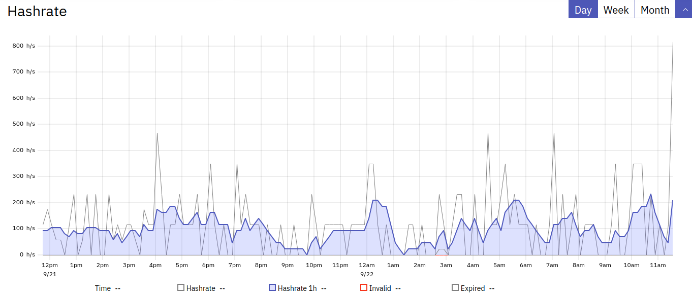

**Raspberry PI 4 Monero XMR Mining**

## Hardware

* [Rasppberry PI 4 8Go](https://www.kubii.fr/cartes-raspberry-pi/2955-raspberry-pi-4-modele-b-8gb-0765756931199.html)
* [Official power supply](https://www.kubii.fr/14-chargeurs-alimentations-raspberry/3292-alimentation-officielle-raspberry-pi-4-51-v-30-a-usb-type-c-prise-us-644824914893.html)
* [Argon One Case](https://www.amazon.fr/gp/product/B086JXR75B)
* A micro SD card Class 10
* A USB key


## Prerequisites

You must assemble your Pi inside the case with functionnal fan and run [Argon One Daemon](https://gitlab.com/DarkElvenAngel/argononed).

This daemon provide cli to monitor and update settings on the fly.

It's a good option to install & run [RPi-Monitor](https://github.com/XavierBerger/RPi-Monitor) to keep eyes on the beast.

You should setup a light OS using Raspbian an setup a full light headless Rasperry Pi including static network to lower ressources usage.

Once you get a fully functionnal lightweight Raspberry Pi you can step to overclocking

## Overclocking

With this case, you can overclock to 2.1Ghz safelly putting this lines bottom of /boot/config.txt

```
boot_delay=1
over_voltage=6
arm_freq=2100
gpu_freq=750
```

One done, reboot a test if it run.

If ok, step to new kernel building!

If not, lower *arm_freq* enough to have a Pi booting.

## Kernel

You need to build and run an optimized Kernel with Huge Page support.

I provided one here [on a Github repository](https://github.com/kraoc/raspberry-linux-64) with readme in *raspberry* folder.

Once you build and reboot you PI with this new kernel, you can step to Miner.

## Miner

I use Xmrig with custom build options.

I provided one here [on a Github repository](https://github.com/kraoc/raspberry-xmrig-64) with readme in *raspberry* folder.

## Mining

You can get a good hashrate :)

*Instant Hashrate*


*Duration Hashrate*



There are sometimes up to 400 h/s instant hashrate !!!

## Monitoring


